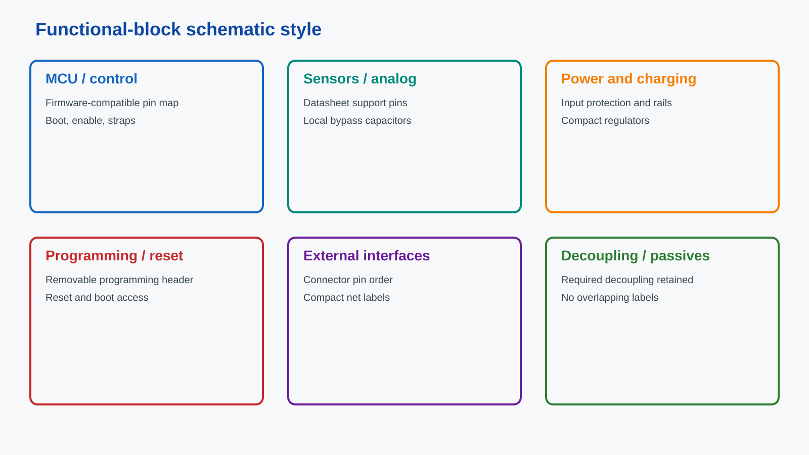

# 嘉立创PCB原理图AI生成

面向 Codex / OpenCode 的嘉立创EDA原理图生成 Skill。

它把原理图设计流程固化为可重复执行的要求：

- 先查芯片数据手册，再确定电源、去耦、复位、启动脚和空闲脚处理；
- 尽量保留用户选定的芯片，不为了画图方便随意替换；
- 在不牺牲稳定性的前提下减少器件数量，并优先选择合适的小封装；
- 使用真实导线网络，不依赖孤立的装饰文字；
- 按功能分区摆放器件并绘制彩色边框和用途标题；
- 使用小标签，避免相邻引脚标签重叠和串口误连；
- 检查器件重叠、文字重叠、不同网络交叉、网表和 DRC；
- 完成后导出或捕获成品原理图，并在对话中直接展示图片。

## 安装

PowerShell：

```powershell
.\install.ps1 -InstallFor All
```

默认安装到：

- Codex：`~/.codex/skills/jlcpcb-schematic-ai-generator`
- OpenCode：`~/.config/opencode/skills/jlcpcb-schematic-ai-generator`

也可以只安装一个目标：

```powershell
.\install.ps1 -InstallFor Codex
.\install.ps1 -InstallFor OpenCode
```

## 文件说明

- `SKILL.md`：Skill 主入口和必须遵守的工作流程。
- `schematic-design-rules.md`：通用原理图设计、选型和验收规则。
- `easyeda-api-playbook.md`：嘉立创EDA实时 API、连线、标签、分区框、网表和 DRC 操作说明。
- `check_schematic_layout.js`：可复用的布局与连接检查函数。
- `schematic-block-preview.svg`：通用分区框选风格示例。



以后直接要求 AI 使用 `jlcpcb-schematic-ai-generator` 画或修改原理图即可。
